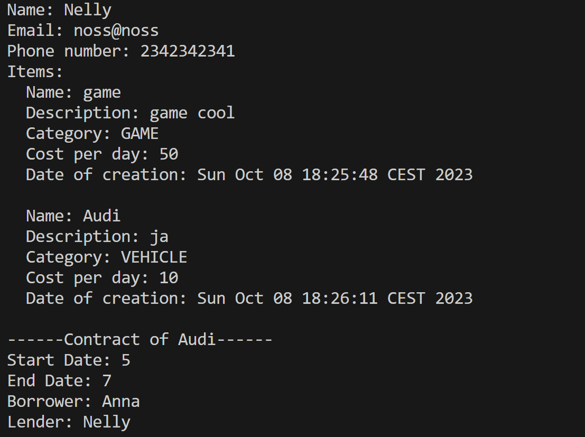
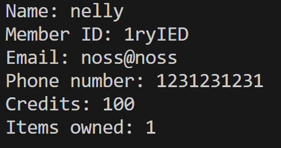
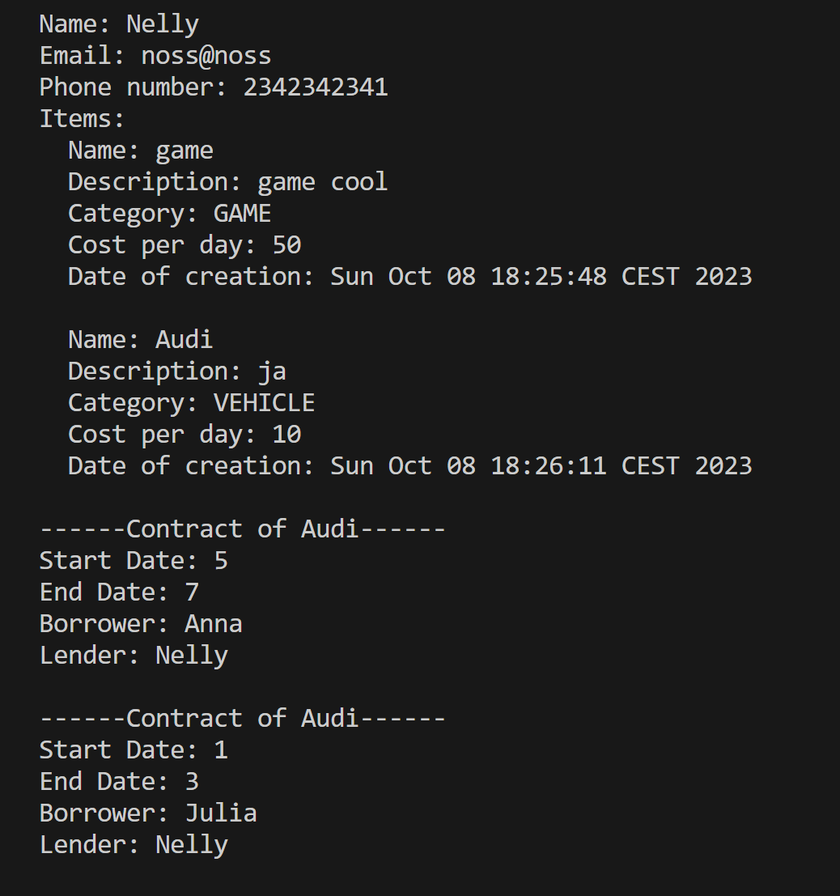

## Stuff Lending Test Report
Version: https://gitlab.lnu.se/1dv607/student/ae224pc/a2/-/tree/nelly-branch?ref_type=heads
Date: 2023.10.08
Environment: Windows, Mac, Java version 18. Performed by: Nelly and Anna

| Case | Result | Note                                           |
| ---- | ------ | ---------------------------------------------- |
| 5.1  | Ok     |          |
| 1.1  | Ok     |                                                |
| 1.2  | Ok     |                                                |
| 1.3  | Ok     |                                                |
| 2.1  | Ok     |          |
| 2.2  | Ok     |                                                |
| 2.3  | Ok     |                                                |
| 3.1  | Ok     |  |
| 3.2  | Not ok |                                                |
| 3.3  | Not oK |                                                |
| 3.4  | Not ok |                                                |
| 3.5  | Not ok |                                                |
| 3.6  | Not ok |                                                |
| 4.1  | Not ok |                                                |
| ---- | ----   | ---------------------------------------------- |
|      |        |                                                |

Date: 2023.10.09

| Case | Result | Note                                           |
| ---- | ------ | ---------------------------------------------- |
| 3.2  | Ok     |                                                |
| 3.3  | Ok     |                                                |
| 3.4  | Ok     |                                                |
| 3.5  | Ok     |                                                |
| 3.6  | Ok     |                                                |
| 4.1  | Ok     |                                                |
| ---- | ----   | ---------------------------------------------- |
|      |        |                                                |

## Test Cases
# 5.1 Member Data

Requirement: 5

   1. Check that there are at least 3 Members.
   2. Check that one member (M1) with 500 credits. M1 has two items for lending, I1 with cost 50 one cheap I2 cost 10
   3. Check that one member (M2) with 100 credits. M2 has no items for lending.
   4. Check that one member (M3) with 100 credits has an active lending contract for I2 that starts on day 5 and ends on day 7 (3 days).

# 1.1 Create Member

Requirement: 1.1, 1.1.1, 1.4

   1. Create a member with name: "Allan Turing", email: "allan@enigma.com", phone: "123456"
   2. Check that the member is created correctly with an id according to the requirement by checking the members full information.
   3. Quit the application

# 1.2 Create Member - Duplicate Email and Phone

Requirement: 1.1, 1.1.1, 1.1.2, 1.4

   1. Create a member with name: "Allan", email: "allan@enigma.com", phone: "123456"
   2. Check that the member is created correctly with an id according to the requirement by checking the members full information.
   3. Create a member with name: "Turing", email: "allan@enigma.com", phone: "123"
   4. Check that the member is not created (duplicate email)
   5. Create a membner with name: "Turing", email: "turing@enigma.com", phone: "123456"
   6. Check that the member is not created (duplicate phone)
   7. Create a member with name "Turing" , email: "turing@enigma.com", phone: "123"
   8. Check that the member is created correctly with an id according to the requirement by checking the members full information.
   9. Quit the application

# 1.3 Delete Member

Requirement: 1.1, 1.1.1, 1.1.2, 1.4

   1. Create a member with name: "Allan", email: "allan@enigma.com", phone: "123456"
   2. Check that the member is created correctly with an id according to the requirement by checking the members full information.
   3. Delete the member
   4. Check that the member is deleted by listing all members (simple)
   5. Create a member with name: "Allan", email: "allan@enigma.com", phone: "123456"
   6. Check that the member is created correctly with an id according to the requirement by checking the members full information.
   7. Quit the application.

# 2.1 Create item

   1. Create an item for a Member
   2. Check that the item is created and part of the Members items by inspecint the member's details.
   3. Check that the owner member has increased it's credits with 100

# 2.2 Delete item

   1. Select a member with one or several items
   2. Delete one of the member's items that is not involved in any contract
   3. Check that the item was deleted from the members owned items

# 2.3 Delete item

   1. Select a member with one or several items
   2. Delete one of the member's items that is booked (i.e. a future contract)
   3. Check that the item was deleted from the members owned items
   4. Check that the contract was cancelled

# 3.1 Create Contract

   1. Create a contract for I2 lending to M2, 3 days of lending, day 1 to and including day 3
   2. Check that the contract was created

# 3.2 Create Contract - not enough funds

   1. Create a contract for I1 lending to M2, 3 days of lending (e.g. day 1 to and including day 3)
   2. Check that the contract was not created due to lack of funds

# 3.3 Create Contract - conflicting time

   1. Create a contract for I2 lending to M2, 3 days of lending, day 4 to and including day 6
   2. Check that the contract was created not created due to conflicting time

# 3.4 Create Contract - conflicting time

   1. Create a contract for I2 lending to M2, 3 days of lending, day 6 to and including day 9
   2. Check that the contract was created not created due to conflicting time

# 3.5 Create Contract - conflicting time

   1. Create a contract for I2 lending to M2, 3 days of lending, day 4 to and including day 9
   2. Check that the contract was created not created due to conflicting time

# 3.6 Create Contract - conflicting time

   1. Create a contract for I2 lending to M2, 3 days of lending, day 6 to and including day 6
   2. Check that the contract was created not created due to conflicting time

# 4.1 Advance time

   1. Advance the time 8 days.
   2. Check that the contract has been fullfilled and that funds have been deduced from M3 who now has 70 credits.